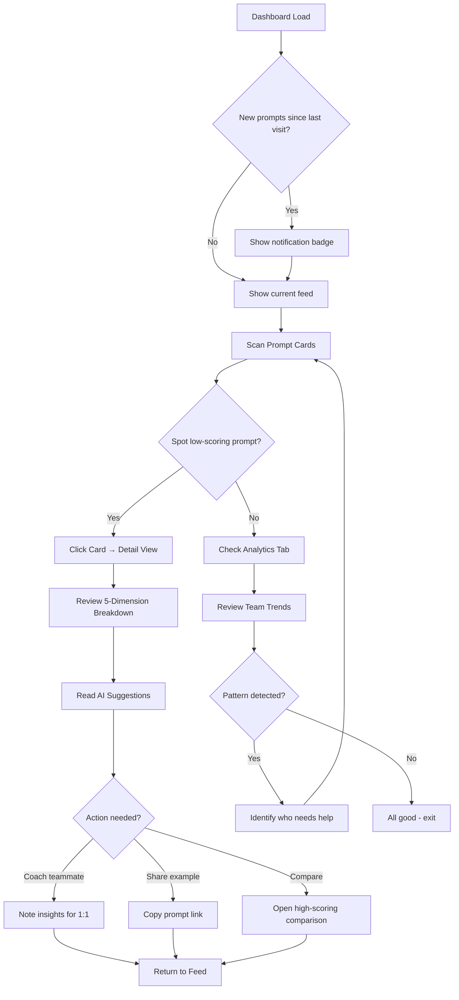
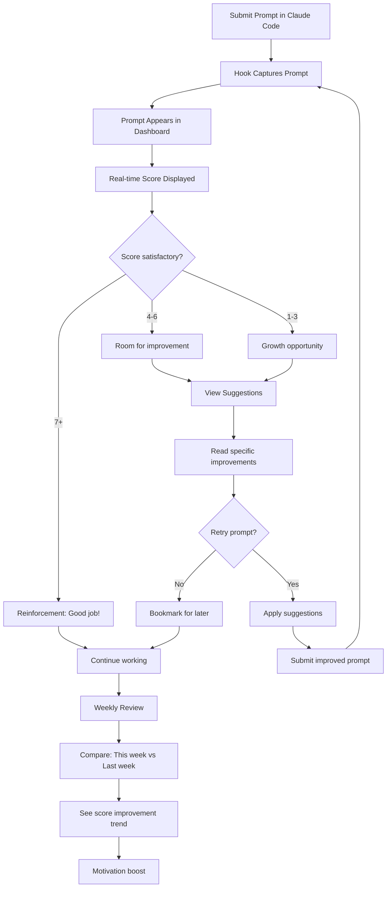
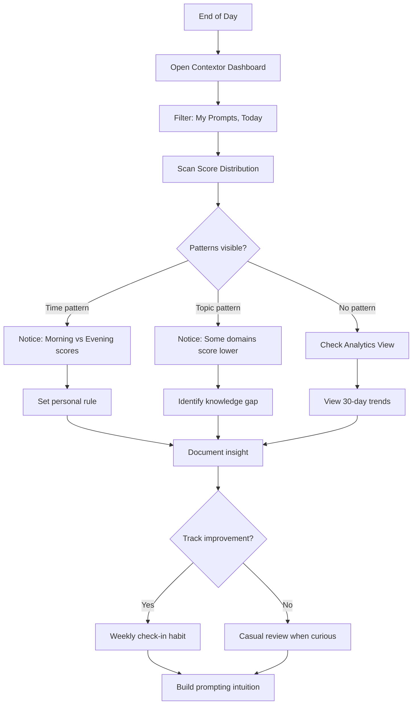

# UX Design Specification contextor

**Author:** Edgars
**Date:** 2025-12-19

---

## Executive Summary

### Project Vision

Contextor transforms AI prompting from an individual skill into a team competency. By making prompts visible, scored, and coachable, it creates a continuous improvement loop that has never existed in AI-assisted development. The platform should feel like a supportive coach, not surveillance software.

### Target Users

**Primary: Development Team Leads (Edgars)**
Senior developers or managers who want visibility into how their team interacts with AI tools. They need to identify prompting issues causing juniors to get stuck and provide targeted, evidence-based feedback.

**Secondary: Junior Developers (Mārtiņš)**
Eager learners who struggle with prompt quality but don't know what they're doing wrong. They need instant, actionable feedback and a safe space to improve without feeling judged.

**Tertiary: Solo Developers (Sofia)**
Independent developers seeking self-improvement through pattern recognition and objective scoring. They value personal insights over team features.

**Admin: Platform Administrators (Alex)**
Technical co-founders/operators managing the platform, tuning analysis configurations, and ensuring system health.

### Key Design Challenges

1. **Coaching Tone Over Surveillance** — The interface must communicate growth and learning, not monitoring and judgment. Every visual choice should reinforce "we're helping you improve."

2. **Information Density Management** — Each prompt has 5 scored dimensions plus suggestions. Design must allow quick scanning while enabling deep dives without overwhelming.

3. **Real-Time Balance** — Live updates must feel fresh and valuable, not chaotic. Users need control over update frequency and filtering.

4. **Multi-Team Context** — Seamless team switching with clear visual indicators of current context to prevent data confusion.

5. **Immediate Value Delivery** — First insight within 5 minutes of install. Onboarding must be minimal but impactful.

### Design Opportunities

1. **Progress Over Perfection** — Use trend visualization and improvement celebration rather than absolute scores. "You've improved 3 points this week" > "You scored 7/10."

2. **Learning by Example** — Side-by-side prompt comparisons (high-scoring vs user's) with highlighted differences create visual teaching moments.

3. **Contextual Micro-Coaching** — Dimension-specific suggestions inline with prompts, not buried in a separate help section.

4. **Personal Pattern Discovery** — Time-based, project-based, and topic-based patterns surfaced proactively ("You prompt less effectively after 9 PM").

## Core User Experience

### Defining Experience

The core experience of Contextor centers on the **prompt analysis reveal** — the moment a user sees their prompt scored, broken down by dimension, with specific improvement suggestions. This single interaction must feel helpful, not judgmental.

The daily loop is: Capture (silent) → Dashboard (glance) → Detail (dive) → Improve (action).

Users should spend most of their time in the prompt feed, scanning scores and occasionally drilling into analysis details. The feed must support both "what just happened" (real-time) and "what happened yesterday" (retrieval) use cases equally well.

### Platform Strategy

**Primary Platform:** Web application (Next.js)
- Desktop-first design with mobile-responsive layouts
- Mouse/keyboard primary, touch-friendly secondary
- No offline requirements
- Progressive enhancement for smaller screens

**Technical Constraints:**
- Real-time updates via Supabase Realtime
- Server Components for initial load performance
- Client Components for interactive filtering
- Tailwind responsive utilities for mobile support

**Future Platform: VS Code Extension (Post-MVP)**
A parallel frontend offering real-time inline coaching as users type prompts. This shifts from reflective analysis ("here's what you did") to proactive coaching ("here's how to do it better right now"). Same API backend, fundamentally different UX pattern.

### Effortless Interactions

| Interaction | Design Requirement |
|-------------|-------------------|
| Dashboard load | < 2 seconds to interactive, prompts visible immediately |
| Score comprehension | Single glance — no mental math required |
| Filter application | Instant, no page reload |
| Team switching | 1 click, immediate context change |
| Prompt retrieval | Date picker + search, results in < 1 second |

**Automatic Behaviors:**
- Prompt capture requires zero user action
- Analysis completes before dashboard check
- Dashboard updates in real-time (no refresh)
- Last-used filters persist across sessions

### Critical Success Moments

1. **First Insight (< 5 minutes from install):** User sees their first prompt with a score. Must feel immediate and meaningful.

2. **Understanding a Low Score:** User clicks into analysis, sees dimension breakdown, reads suggestion, and thinks "oh, that's what I missed."

3. **Pattern Recognition:** Team lead filters by user, sees consistent low scores on "Context Completeness," has specific coaching target.

4. **Improvement Proof:** User views their 30-day trend, sees upward trajectory, feels motivated to continue.

### Experience Principles

1. **Glanceable First, Deep-Dive Available**
   Every screen works at a glance. Overall score visible without clicking. Dimension breakdown one click away. Full prompt text expandable. Progressive disclosure, never information overload.

2. **Growth Mindset Everywhere**
   Use improvement-focused language ("improving," "learning," "developing"). Avoid judgmental language ("failing," "poor," "bad"). Celebrate progress with trend indicators. Frame low scores as "opportunities" not "failures."

3. **Silent Capture, Visible Value**
   Capture happens without user awareness. No modal confirmations, no status indicators during coding. Value appears in dashboard when user is ready. The tool is invisible during work, valuable during reflection.

4. **Context Sticks**
   Current team persists across sessions. Applied filters persist until cleared. View preferences (sort order, display density) remembered. Never force users to re-establish their working context.

## Desired Emotional Response

### Primary Emotional Goals

**For Junior Developers (Mārtiņš):** Feel safe to fail and learn. The platform should feel like a supportive coach, not a surveillance system. Initial apprehension about being "watched" must transform into appreciation for growth opportunities.

**For Team Leads (Edgars):** Feel empowered to help effectively. Finally having visibility into team prompting patterns should feel like gaining superpowers for coaching, not like spying on employees.

**For Solo Developers (Sofia):** Feel curious about self-improvement. Insights should feel like personal discoveries, sparking interest in patterns and growth areas.

**For Platform Admins (Alex):** Feel in control of system health. Dashboards should convey confidence that everything is working, with clear signals when attention is needed.

### Emotional Journey Mapping

| Journey Stage | Target Emotion | Design Response |
|---------------|----------------|-----------------|
| First Discovery | Hope, Curiosity | Clear value proposition, no surveillance language |
| First Score | Clarity, Understanding | Immediate explanation of what score means |
| Low Score Moment | Direction, Motivation | Specific suggestions, upward-pointing indicators |
| Improvement Over Time | Pride, Accomplishment | Trend visualization, milestone celebrations |
| Team Visibility | Belonging, Trust | Framed as team learning, not individual judgment |
| Error States | Confidence, Control | Clear recovery paths, no blame language |

### Micro-Emotions

**Prioritized Emotional States:**

1. **Confidence over Confusion** — Every score is immediately understandable. No unexplained numbers.

2. **Trust over Skepticism** — Analysis reasoning is transparent. Users can see why they got each dimension score.

3. **Accomplishment over Frustration** — Progress is always visible. Even small improvements are acknowledged.

4. **Belonging over Isolation** — Team context shows "we're all learning together" not "you're being watched."

5. **Growth over Judgment** — Language consistently frames prompting as a developing skill, not an innate ability.

### Design Implications

| Emotional Goal | UX Implementation |
|----------------|-------------------|
| Safe to fail | No "failure" language. Neutral colors for low scores (not red). Improvement arrows always present. |
| Empowered to help | Team views surface actionable patterns with specific coaching suggestions. |
| Curious about self | Insights framed as discoveries ("You found: Morning prompts score 40% higher"). |
| In control | Green-first dashboards. System health prominent. Problems secondary. |
| Growth mindset | Trend direction always visible. Celebrate streaks and personal bests. |

**Emotions to Prevent:**

| Avoid | Prevention Strategy |
|-------|---------------------|
| Shame | No public leaderboards. Personal scores visible only to self + authorized team leads. |
| Paranoia | Transparent data policies. Users can view/export their own data anytime. |
| Overwhelm | Progressive disclosure. Score → Dimensions → Details → Full prompt. |
| Futility | Every low score includes specific, actionable improvement suggestion. |

### Emotional Design Principles

1. **Growth Over Grades**
   Every visual and verbal element reinforces skill development, not evaluation. Use "developing," "improving," "learning" — never "failing," "poor," "bad."

2. **Discovery Over Surveillance**
   Frame all insights as self-knowledge. "You discovered that..." not "We tracked that..." The user is the protagonist, not the subject.

3. **Direction Over Judgment**
   Low scores always accompanied by upward arrows and specific next steps. A score is never just a number — it's a starting point for improvement.

4. **Celebration Over Comparison**
   Celebrate personal bests and improvement streaks. No team rankings or "worst performer" visibility. Competition is with yesterday's self, not teammates.

## UX Pattern Analysis & Inspiration

### Inspiring Products Analysis

**Linear**
- Best-in-class developer tool UX
- Keyboard-first, blazing fast interactions
- Clean information density without overwhelm
- Minimal chrome, maximum content focus
- Dark mode native, developer-familiar patterns
- Real-time updates feel seamless, not chaotic

**Sparks Dashboard (Aura)**
- Bold, vibrant color palette on dark background
- Card-based layout with large rounded corners
- Clear visual hierarchy: category → title → metadata → metric
- High contrast makes information scannable
- Playful yet professional aesthetic
- Icon-only sidebar navigation

### Transferable UX Patterns

**Navigation Patterns:**
- Icon-only sidebar (Linear, Sparks) — minimal footprint, familiar to developers
- Keyboard shortcuts for power users (Linear) — essential for developer tools

**Card Patterns:**
- Color-coded cards by status/category (Sparks) — instant visual scanning
- Prominent primary metric with subtle metadata (Sparks) — score visible at glance
- Avatar indicators for ownership (Sparks) — team context on each item

**Interaction Patterns:**
- Real-time updates without page refresh (Linear) — Supabase Realtime fits perfectly
- Quick filters and search (Linear) — essential for prompt retrieval
- Progressive disclosure via expandable cards — score first, details on demand

**Visual Patterns:**
- Dark mode as default — developer preference, reduces eye strain
- Vibrant accents on neutral background — draws attention to what matters
- Generous whitespace and large corner radius — modern, approachable feel

### Anti-Patterns to Avoid

| Anti-Pattern | Why Avoid | Our Alternative |
|--------------|-----------|-----------------|
| Red for low scores | Triggers shame/failure emotions | Neutral warm tones with upward arrows |
| Dense data tables | Overwhelming, not scannable | Card-based feed with progressive disclosure |
| Notification overload | Creates anxiety, users disable | Calm defaults, user-controlled frequency |
| Public leaderboards | Competition breeds resentment | Personal progress only, no team rankings |
| Complex onboarding | Delays time-to-value | Install → first insight in < 5 minutes |

### Design Inspiration Strategy

**Adopt Directly:**
- Dark mode as default aesthetic
- Icon-only sidebar navigation
- Card-based prompt feed layout
- Real-time updates via subscriptions
- Keyboard shortcuts for common actions

**Adapt for Contextor:**
- Color-coded cards: Map to score ranges, not arbitrary categories
  - Teal/green tones: High scores (7-10)
  - Yellow/amber tones: Medium scores (4-6)
  - Warm coral tones: Growth opportunities (1-3)
- Metric prominence: Overall score as the "hero number" on each card
- Category badges: Source (Claude Code, BMAD) instead of department

**Avoid:**
- Red/danger colors for any score — conflicts with growth mindset
- Complex nested navigation — keep it flat and fast
- Heavy animations — developers prefer speed over flourish

## Design System Foundation

### Design System Choice

**Base System:** shadcn/ui + Tailwind CSS + Radix UI

This combination provides:
- Accessible, unstyled Radix primitives as foundation
- shadcn/ui component patterns (copy-paste, fully customizable)
- Tailwind CSS for rapid styling iteration
- Full dark mode support out of the box
- No runtime CSS-in-JS overhead

### Rationale for Selection

1. **Already in Architecture** — Aligned with Next.js 15 + Supabase starter template
2. **Full Customization** — Unlike Material UI or Chakra, shadcn/ui components are copied into your codebase. You own them completely.
3. **Developer Familiarity** — Tailwind is standard in modern React development
4. **Accessibility Built-In** — Radix primitives handle keyboard navigation, screen readers, focus management
5. **Perfect for Bold Customization** — Easy to transform neutral defaults into Sparks-inspired vibrancy

### Implementation Approach

**Tailwind Configuration:**
```javascript
// tailwind.config.ts
colors: {
  background: '#0a0a0a',      // Dark charcoal base
  card: {
    high: '#0d9488',          // Teal for high scores
    medium: '#f59e0b',        // Amber for medium scores
    growth: '#f87171',        // Coral for growth opportunities
  },
  primary: '#14b8a6',         // Teal accent
  muted: '#27272a',           // Subtle backgrounds
}
```

**Component Customization Priority:**
1. Theme tokens (colors, radius, spacing) — First
2. Card component — Custom build for prompts
3. Sidebar navigation — Custom icon-only design
4. Score/metric displays — Custom typography treatment
5. Charts — Themed Recharts integration

### Customization Strategy

**What We Keep from shadcn/ui:**
- Button, Input, Dialog, Dropdown patterns
- Form handling and validation patterns
- Toast/notification system
- Modal and sheet patterns

**What We Customize Heavily:**
- Color palette (dark mode, vibrant accents)
- Border radius (larger, more playful)
- Card components (solid color fills vs subtle borders)
- Typography weights (bolder for metrics)

**What We Build Custom:**
- PromptCard — Score-colored card with progressive disclosure
- ScoreDisplay — Bold metric with trend indicator
- DimensionBreakdown — 5-dimension visualization
- IconSidebar — Linear/Sparks-style navigation
- TrendChart — Personal progress visualization

## Defining Experience

### The Core Interaction

**"See your prompt scored and understand why — instantly."**

This is the interaction that will define Contextor. When a user opens the dashboard, sees their prompt with a score, clicks into the analysis, and thinks "oh, that's what I should have included" — that's the moment they become a believer.

If we nail this single interaction perfectly:
- Team visibility becomes valuable (leaders can see where juniors struggle)
- Trends become motivating (users want to see their progress)
- Team learning becomes natural (comparing high vs low scores teaches)

### User Mental Model

**Current State (No Solution):**
Users currently have no visibility into prompt quality. They guess why AI responses fail, iterate blindly, and occasionally ask teammates for tips. There's no systematic feedback loop.

**Mental Models They Bring:**
- Code quality tools (ESLint scores, SonarQube ratings) — familiar with automated scoring
- Traffic light systems — green/yellow/red intuition
- Real-time feedback — expect Grammarly-style instant scoring
- Actionable suggestions — want "do this" not just "you failed"

**Potential Confusion Points:**

| Risk | Mitigation |
|------|------------|
| "What do dimensions mean?" | Clear labels + hover tooltips + first-time education |
| "Why this score?" | Quote specific prompt text that caused the score |
| "How do I improve?" | Concrete suggestion with example |

### Success Criteria

| Criterion | Target | How We'll Know |
|-----------|--------|----------------|
| **Instant clarity** | < 3 seconds to understand score | User doesn't need to click to know "high/medium/low" |
| **Obvious causation** | Score traceable to prompt text | Suggestions quote specific phrases from user's prompt |
| **Actionable direction** | Clear next step | Every low dimension has a specific improvement suggestion |
| **Pride in progress** | Improvement feels good | Trend indicators, streak celebrations, milestone markers |
| **No shame** | Low scores feel like opportunity | Language, colors, and framing all support growth mindset |

### Pattern Innovation

**Established Patterns We Adopt:**
- Score display (Grammarly, ESLint)
- Card-based feed (Linear, Notion)
- Dimension breakdowns (analytics dashboards)
- Trend visualization (fitness apps)

**Our Novel Contributions:**
1. **Prompt-Specific Coaching** — Not generic "add more context" but "in this prompt, consider referencing the auth.ts file you mentioned earlier"
2. **Team Learning Without Surveillance** — See patterns and coaching opportunities, not raw surveillance data
3. **Growth-First Framing** — Every visual and verbal element reinforces improvement over judgment

### Experience Mechanics

**1. Initiation**
User opens dashboard → sees prompt feed → latest prompts visible with scores on cards.
- No login friction (session persists)
- Real-time: new prompts appear automatically
- Context preserved: last-used filters still applied

**2. Interaction Flow**
```
[Card View] Score visible at glance
     ↓ click
[Expanded View] 5 dimensions with bars + overall score
     ↓ hover dimension
[Tooltip] Detailed explanation + specific suggestion
     ↓ click "Show prompt"
[Full View] Complete prompt text with issues highlighted
```

**3. Feedback System**

| Element | Purpose |
|---------|---------|
| Score color (teal/amber/coral) | Instant quality signal |
| Trend arrow (↑ → ↓) | Progress direction |
| Dimension bars | Visual progress toward 10/10 |
| Quoted suggestions | Specific, actionable, from their text |

**4. Completion**
- User understands their score
- User has 1-2 concrete improvements to try
- User can close and continue (or explore trends)
- Success: user prompts better next time

## Visual Design Foundation

### Color System

**Base Palette (Dark Mode):**

| Token | Hex | Usage |
|-------|-----|-------|
| `--background` | #0a0a0a | Page background |
| `--surface` | #141414 | Card default background |
| `--muted` | #27272a | Borders, dividers |
| `--foreground` | #fafafa | Primary text |
| `--muted-foreground` | #a1a1aa | Secondary text |

**Score Colors (Growth-Oriented):**

| Score Range | Token | Hex | Card Fill |
|-------------|-------|-----|-----------|
| High (7-10) | `--score-high` | #14b8a6 | Teal card |
| Medium (4-6) | `--score-medium` | #f59e0b | Amber card |
| Growth (1-3) | `--score-growth` | #f87171 | Coral card |

**Semantic Colors:**

| Token | Hex | Usage |
|-------|-----|-------|
| `--primary` | #14b8a6 | CTAs, links, active |
| `--secondary` | #8b5cf6 | Highlights, badges |
| `--info` | #38bdf8 | Informational |

**Color Philosophy:**
- No "red = bad" for scores — coral represents growth opportunity
- High contrast for readability on dark backgrounds
- Vibrant accents on neutral base

### Typography System

**Font Stack:**
```css
--font-sans: 'Inter', ui-sans-serif, system-ui, sans-serif;
--font-mono: 'JetBrains Mono', ui-monospace, monospace;
```

**Type Scale:**

| Token | Size | Weight | Line Height | Usage |
|-------|------|--------|-------------|-------|
| `--text-display` | 48px | 700 | 1.1 | Hero only |
| `--text-h1` | 32px | 600 | 1.2 | Page titles |
| `--text-h2` | 24px | 600 | 1.3 | Sections |
| `--text-h3` | 18px | 500 | 1.4 | Card titles |
| `--text-body` | 14px | 400 | 1.5 | Default |
| `--text-small` | 12px | 400 | 1.4 | Captions |
| `--text-metric` | 32px | 700 | 1.0 | Scores |

### Spacing & Layout Foundation

**Spacing Scale (8px base):**

| Token | Value |
|-------|-------|
| `--space-1` | 4px |
| `--space-2` | 8px |
| `--space-3` | 12px |
| `--space-4` | 16px |
| `--space-6` | 24px |
| `--space-8` | 32px |
| `--space-12` | 48px |

**Border Radius:**

| Token | Value | Usage |
|-------|-------|-------|
| `--radius-sm` | 6px | Buttons, inputs |
| `--radius-md` | 12px | Small cards |
| `--radius-lg` | 16px | Prompt cards |
| `--radius-full` | 9999px | Avatars |

**Layout Grid:**
- Sidebar: 64px fixed width (icon-only navigation)
- Content: Max 1200px, centered
- Card grid: CSS Grid auto-fill, min 320px
- Responsive: Single column below 768px

### Accessibility Considerations

| Aspect | Standard | Implementation |
|--------|----------|----------------|
| Color contrast | WCAG AA (4.5:1) | All text meets minimum |
| Color independence | Don't rely on color alone | Scores include trend arrows |
| Focus visibility | Visible focus rings | 2px ring on all interactive |
| Motion | Respect preferences | `prefers-reduced-motion` support |
| Font size | Readable defaults | Base 14px, minimum 12px |
| Touch targets | 44x44px minimum | All clickable areas meet standard |

## Design Direction Decision

### Chosen Direction

The design direction was validated through the Aura prototype (see `_bmad-output/aura-prompt.md`). Key elements:
- Dark mode with near-black background (#0a0a0a)
- Score-colored prompt cards (Teal/Amber/Coral solid fills)
- 64px icon-only sidebar navigation
- 16px border radius on cards
- Linear + Sparks Dashboard aesthetic fusion

### Design Rationale

1. **Developer-first aesthetic** — Dark mode reduces eye strain during long sessions
2. **Color as signal** — Score colors on card backgrounds provide instant recognition
3. **Minimal chrome** — Icon-only sidebar maximizes content area
4. **Modern, approachable** — Large corner radius + generous spacing feels premium

## User Journey Flows

### Team Lead Review Flow (Edgars)

**Goal:** Gain visibility into team prompts, identify coaching opportunities



**Key Moments:**
- **Entry:** Dashboard with real-time prompt feed
- **Discovery:** Color-coded cards for instant score recognition
- **Deep Dive:** Dimension breakdown with specific suggestions
- **Action:** Coach, share, or compare

---

### Junior Developer Learning Loop (Mārtiņš)

**Goal:** Learn from feedback, improve prompt skills over time



**Key Moments:**
- **Capture:** Seamless, no friction
- **Feedback:** Immediate score + explanation
- **Learning:** Specific, actionable suggestions
- **Progress:** Visible improvement over time

---

### Solo Developer Self-Reflection (Sofia)

**Goal:** Self-improvement through pattern discovery



**Key Moments:**
- **Minimal friction:** Just browse when curious
- **Self-discovery:** Patterns emerge from data
- **Personal rules:** User-driven improvements
- **Long-term tracking:** Visible progress

---

### Journey Patterns

**Navigation Patterns:**

| Pattern | Description | Used In |
|---------|-------------|---------|
| Feed → Detail | Click card to expand full analysis | All journeys |
| Filter & Focus | Quick filters for user/project/date/score | Team review, Self-reflection |
| Tab Navigation | Feed → Analytics → Team | All views |

**Feedback Patterns:**

| Pattern | Description | Emotion |
|---------|-------------|---------|
| Color-coded cards | Teal/Amber/Coral backgrounds | Instant recognition |
| Score + Trend | "7.2 ↑0.8" format | Progress visibility |
| Growth framing | "Opportunity" not "Failure" | Supportive, not judgmental |

**Decision Patterns:**

| Pattern | Description |
|---------|-------------|
| Progressive disclosure | Summary card → Full detail on click |
| Comparison toggle | "Show high-scoring example" |
| Action shortcuts | Copy link, add note, flag for review |

---

### Flow Optimization Principles

**1. Time to Value**
- Dashboard loads in < 2 seconds with prompts visible
- No onboarding wizard blocking first use
- Score visible within 5 seconds of prompt capture

**2. Cognitive Load Reduction**
- Max 5 dimensions shown (already capped)
- Color does the work — no need to read numbers
- One primary action per view

**3. Error Recovery**
- "No prompts yet" state with clear next step
- Retry prompt capture if hook fails
- Graceful degradation if analysis delayed

**4. Moments of Delight**
- Score improvement celebration ("↑1.2 this week!")
- Personal best notification
- Streak tracking (7 days of 7+ scores)

## Component Strategy

### Visual Source of Truth

**CRITICAL: The HTML prototypes are the definitive visual specification. Implementation MUST follow these prototypes closely for all styling, layout, and visual treatment decisions.**

| Prototype | Contents | Path |
|-----------|----------|------|
| **Marketing Page** | Landing page, Hero, Features, Login | `_bmad-output/user-uploads/contextor-marketing-page.html` |
| **Web App UI** | Dashboard, Feed, Analytics, Team, Projects, Detail views | `_bmad-output/user-uploads/contextor-web-app-ui.html` |

**Note:** The `_bmad-output/ux-visual-preview.html` file is a color/typography reference only. The above prototypes are the actual UI designs to implement.

**Design Fidelity Requirements:**
- Match the exact color values from prototypes (`#0a0a0a` background, `#14b8a6` teal accent, etc.)
- Preserve the 64px icon-only sidebar pattern
- Maintain the score-colored left accent bars on prompt rows
- Use the circular score badges with tier-based coloring
- Follow the card/row layouts and spacing exactly as shown

### Design System

- **Base:** shadcn/ui + Tailwind CSS
- **Icons:** Lucide React
- **Charts:** D3.js or Recharts
- **Font:** Inter (Google Fonts)

### Component Inventory

| Component | Type | Description |
|-----------|------|-------------|
| PromptRow | Custom | Full-width list item with score accent bar |
| ScoreBadge | Custom | Circular badge, color-coded by score tier |
| DimensionBar | Custom | Horizontal progress bar with label and score |
| StatCard | Custom | Metric card with value and trend indicator |
| SidebarNav | Custom | 64px icon-only vertical navigation |
| DateGroupHeader | Custom | Sticky date separator in feed |
| ProjectCard | Custom | Project info with install command and members |
| MemberChip | Custom | Avatar + name pill for team display |
| FilterChip | Custom | Toggle button for feed filtering |
| TrendChart | Custom | Line chart for score trends (D3/Recharts) |
| DimensionChart | Custom | Horizontal bar chart for dimension comparison |

### States to Implement

| State | Components Affected | Behavior |
|-------|---------------------|----------|
| Loading | PromptRow, StatCard, Charts | Skeleton placeholders |
| Empty | Prompt Feed | "No prompts yet" with setup instructions |
| Error | API calls | Toast notification with retry option |
| Hover | PromptRow, SidebarNav, Buttons | Subtle background highlight |
| Active | SidebarNav | Teal background, white icon |
| Focus | All interactive | 2px teal focus ring |

### Accessibility Requirements

| Requirement | Implementation |
|-------------|----------------|
| Keyboard navigation | All interactive elements focusable, Enter/Space to activate |
| Screen reader | ARIA labels on icons, live regions for score updates |
| Color independence | Scores show numbers, not just colors |
| Focus indicators | Visible 2px ring on all focusable elements |
| Reduced motion | Respect `prefers-reduced-motion` for animations |

## UX Patterns

### Navigation Patterns

| Pattern | Implementation | Used In |
|---------|----------------|---------|
| Icon sidebar | 64px fixed left, scroll-spy active states | All app views |
| Tab scrolling | Smooth scroll to section on icon click | Dashboard |
| Back navigation | Back arrow in detail views | Prompt Detail |
| Breadcrumb | Not used — flat navigation model | — |

### Interaction Patterns

| Pattern | Trigger | Result |
|---------|---------|--------|
| Row click | Click prompt row | Navigate to detail view |
| Filter toggle | Click filter chip | Filter list, update active state |
| Copy to clipboard | Click copy icon | Copy text, show toast confirmation |
| Dropdown select | Click dropdown | Show options, update selection |
| Modal dismiss | Click outside or X | Close modal |

### Feedback Patterns

| Scenario | Feedback Type | Duration |
|----------|---------------|----------|
| Action success | Toast (teal) | 3 seconds |
| Action error | Toast (coral) | 5 seconds + dismiss |
| Loading data | Skeleton animation | Until loaded |
| Empty state | Illustration + message | Persistent |
| Score update | Animate number change | 300ms |

### Data Display Patterns

| Pattern | Usage |
|---------|-------|
| Score color coding | Teal (7+), Amber (4-6), Coral (1-3) — applied to badges, bars, accents |
| Trend indicators | Arrow + signed number (+0.8 ↑ or -0.2 ↓) |
| Truncation | 2-line clamp for prompt text in list, full text in detail |
| Date grouping | Sticky headers, "Today" / "Yesterday" labels |
| Relative time | "2:34 PM" for today, "Dec 18" for older |

### Form Patterns

| Pattern | Implementation |
|---------|----------------|
| Input focus | Teal border on focus |
| Validation | Inline error below field |
| Submit | Primary button, loading spinner during submit |
| Success | Redirect or toast confirmation |

## Responsive Design

### Breakpoints

| Breakpoint | Width | Layout Changes |
|------------|-------|----------------|
| Desktop | ≥1024px | Full sidebar (64px) + main content |
| Tablet | 768-1023px | Collapsible sidebar, 2/3+1/3 detail layout maintained |
| Mobile | <768px | Bottom navigation bar, single column, full-width detail |

### Component Adaptations

| Component | Desktop | Mobile |
|-----------|---------|--------|
| SidebarNav | Fixed left 64px | Hidden, replaced by bottom nav |
| PromptRow | Full layout with all metadata | Stacked: score + text, metadata below |
| Prompt Detail | 2/3 + 1/3 columns | Single column, analysis below prompt |
| StatCard row | 5 cards horizontal | 2x2 grid + 1 |
| Charts | Side by side | Stacked vertically |
| Filters | Horizontal row | Horizontal scroll or dropdown |

### Mobile Bottom Navigation

```
┌─────────────────────────────────────────────┐
│   📋 Feed    📊 Analytics    👥 Team    ⚙️   │
└─────────────────────────────────────────────┘
```

## Accessibility Compliance

### WCAG 2.1 AA Targets

| Criterion | Requirement | Implementation |
|-----------|-------------|----------------|
| 1.4.3 Contrast | 4.5:1 text, 3:1 UI | Dark theme colors tested |
| 2.1.1 Keyboard | All functions via keyboard | Tab order, Enter/Space activation |
| 2.4.7 Focus Visible | Clear focus indicators | 2px teal ring |
| 4.1.2 Name, Role, Value | Proper ARIA labels | Icon buttons labeled |

### Screen Reader Support

| Element | ARIA Implementation |
|---------|---------------------|
| Sidebar icons | `aria-label="Feed"`, `aria-current="page"` |
| Score badge | `aria-label="Score: 8.5 out of 10, high"` |
| Prompt row | `aria-label` with prompt summary |
| Charts | `aria-hidden="true"` with text alternative |
| Live updates | `aria-live="polite"` for new prompts |

### Keyboard Navigation

| Key | Action |
|-----|--------|
| Tab | Move between interactive elements |
| Enter/Space | Activate buttons, open rows |
| Escape | Close modals, cancel actions |
| Arrow keys | Navigate within dropdown menus |

---

## Document Status

**UX Design Specification Complete**

| Artifact | Location | Purpose |
|----------|----------|---------|
| UX Specification | `_bmad-output/ux-design-specification.md` | Requirements, flows, patterns |
| **Marketing Page Prototype** | `_bmad-output/user-uploads/contextor-marketing-page.html` | **Visual source of truth** for landing/login |
| **Web App UI Prototype** | `_bmad-output/user-uploads/contextor-web-app-ui.html` | **Visual source of truth** for dashboard |
| Color/Typography Preview | `_bmad-output/ux-visual-preview.html` | Reference only (not for implementation) |
| Aura Prompt | `_bmad-output/aura-prompt.md` | AI tool prompt used to generate prototypes |

**Implementation Notes:**
- Follow the HTML prototypes exactly for visual styling
- The prototypes use Tailwind CSS classes that map directly to implementation
- All color values, spacing, and component patterns are defined in the prototypes

**Ready for implementation.**
